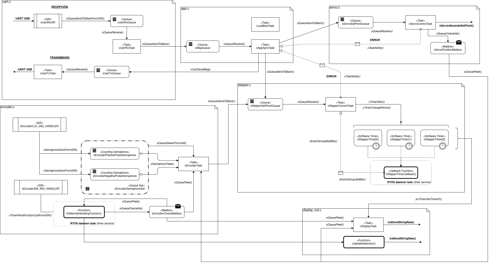

RTOS en placa de desarrollo EDU-CIAA para el control de un accionamiento electromecánico básico
---

El objetivo del trabajo es la implementación de una aplicación basada en el sistema operativo de tiempo real freeRTOS, sobre la placa de desarrollo EDU-CIAA, para el control de un sistema electromecánico básico que tiene como fin únicamente la demostración visual de lo que sucede en la electrónica. Se busca implementar todos los conceptos fundamentales de freeRTOS, basándose en el libro *Mastering the freeRTOS Real Time Kernel*, por más que algunos de estos conceptos tengan una aplicación forzada y se alejen de lo práctico o lo más conveniente. Esto es porque la principal finalidad del proyecto es aprender a utilizar freeRTOS por sobre obtener un controlador del sistema con buen criterio de diseño y eficiente.

Además, el proyecto también busca una introducción al flujo de trabajo del proyecto CIAA (Computadora Industrial Abierta Argentina). Salvo algunas excepciones, no se profundizó en la programación de los microcontroladores a nivel de registros, sino que se utilizó la capa de abstracción proveída por la librería sAPI, incluida en el firmware de dicho proyecto CIAA.

